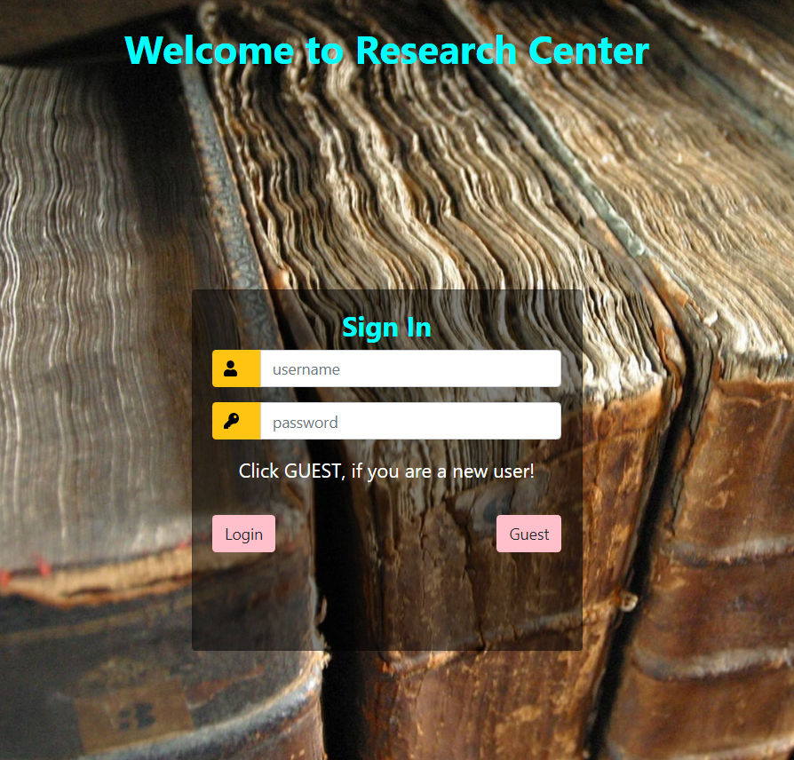
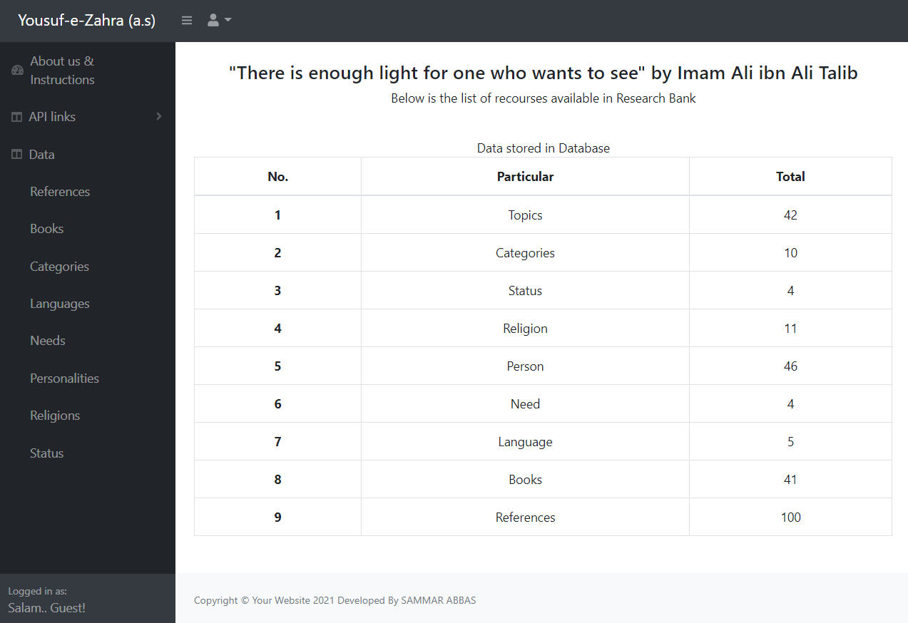
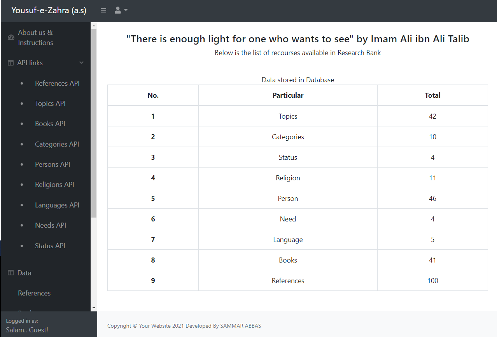
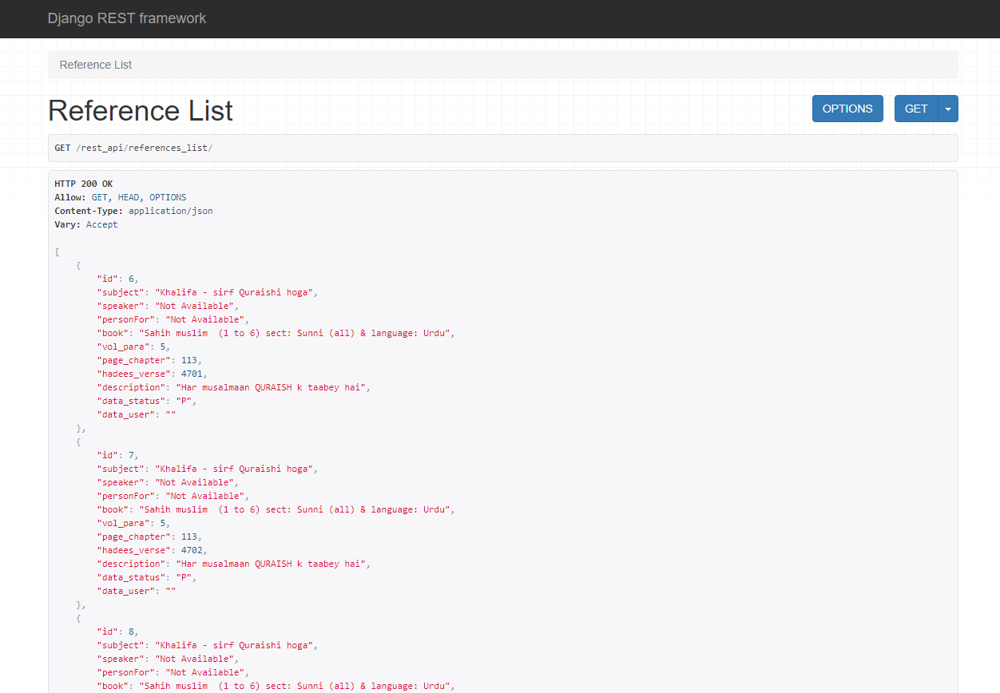

# Books & Research Center
It contains list of books from those Research material is gathered.
-------------------------------------------------------------------

# Login Page:
Login using ID and Password or simply click 'GUEST' button to login
as a guest.

# Main Page:
Main page contain list of records fetch from APIs.
Left NavBar two(2) buttons "API links" and "Data" are available.

# list under Data Left NavBar:

Under "Data" Button, list is available for user.
By clicking any of item in list, New page will be open by fetching related data

# list under API Links Left NavBar:

Under "API links" Button, list of API is available for user.
By clicking any of API item in list, new window will be opened by routing 
user to API,

# Reference API link:

By clicking on 'References API', following page will pop-up.
Same functionality is set on other APIs linked button.

# API links:

List of APIs available:

1. [References API](https://live-search-restful-api.herokuapp.com/rest_api/references_list/) - (https://live-search-restful-api.herokuapp.com/rest_api/references_list/)

2. [Topics API](https://live-search-restful-api.herokuapp.com/rest_api/topics_list/) - (https://live-search-restful-api.herokuapp.com/rest_api/topics_list/)

3. Books API
    * Categories API
    * Persons API
    * Religions API
    * Languages API
    * Needs API
    * Status API